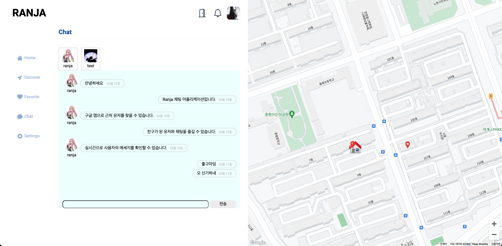
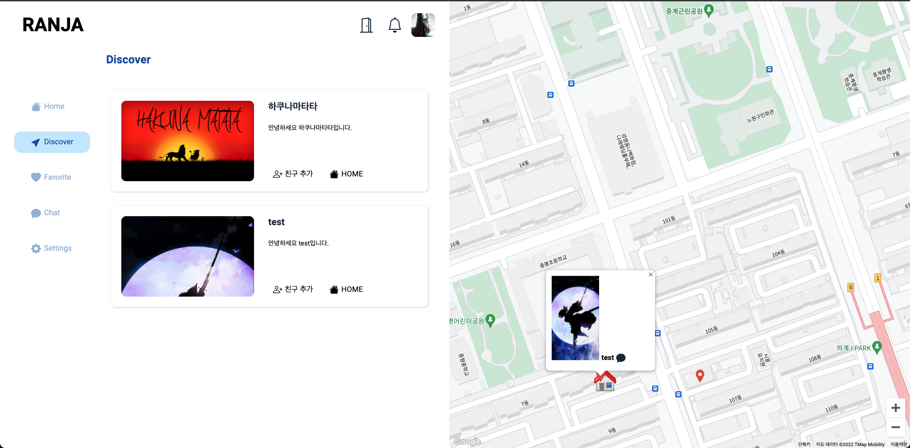
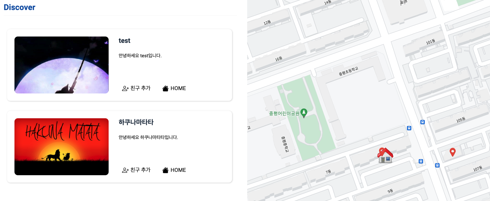

# RANJA

<a href="http://www.ranja.o-r.kr">http://www.ranja.o-r.kr</a>

    구글 맵 기반 채팅 메신저 플랫폼

client repository: 현재 변경 작업 중에 있습니다. 
<!-- <a href="https://github.com/ranjafunc/ranja-frontend">https://github.com/ranjafunc/ranja-frontend</a> -->

api repository: 
<a href="https://github.com/ranjafunc/ranja-backend">https://github.com/ranjafunc/ranja-backend</a>

 

# 📝 Summary

“Zenly” 앱에 영감을 받아 구글 맵 채팅 플랫폼을 기획하였습니다. 기본 Zenly 앱에서 구현한 채팅 기능에 더해서 사용자가 자신이 공유하고 싶은 맛집, 피시방, 술집 등을 구글 맵을 활용하여 마킹하고 다른 사용자가 구경할 수 있다면 재밌지 않을까 싶어서 개발하게 되었습니다. 현재 원하는 사용자의 위치를 저장하고 근처 유저들과 실시간 채팅, 친구 요청, 좌표 이동 등의 상호작용을 할 수 있으며 현재 공유 기능을 개발 중이고 꾸준히 업데이트 중입니다.

 

# ⭐️ Key Function

- **지도 현재 위치 중심 좌표 기준으로 근처 유저 조회**
- **사용자간 실시간 채팅 기능 제공**
  - 친구 관계인 유저 간에만 허용
- **사용자 친구 위치 확인 가능**

 

# 🛠 Tech Stack

### Frontend

`Typescript` `React.js` `Styled-components` `axios` `Redux-saga` `Socket.io` `ESLint` `GoogleMap`

### **Backend**

`Node.js` `Express.js` `Passport.js` `Socket.io` `MongoDB` `Mongoose`

### Deploy

`Heroku` `MongoDB atlas` `IMGbb(이미지 서버 및 업로드 API 제공)`

 

# 🤔 Learned

- `Typescript` `EsLint`를 활용하면서 왜 체계적이고 클린한 개발을 추구하게 되는지 이해하게 되었습니다.
- `Redux-Saga`를 통해 비동기적인 상태관리를 컨트롤하고 작성하는 법을 배웠습니다.
- `Styled-Components Theme`를 통하여 스타일을 좀 더 체계적이고 글로벌하게 관리하는 법을 배웠습니다.
- `MongoDB`와 `Mongoose`를 통하여 NoSQL에서 데이터를 조회하고 조합하며 프론트에서 처리하는 방식에 대하여 좀 더 익숙해졌습니다.
- 같은 도메인이 아닌 서버끼리 쿠키 공유를 할 수 없다거나 CORS 문제, API Server와 Client Server를 분리하지 않으면서 SOEP 문제로 이미지를 불러올 수 없는 등 많은 경험을 하면서 웹 전반적인 정책에 대해서도 익숙해졌습니다.

 

# 📷 Screenshot

